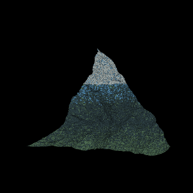

# Fractal Social Media App

This project is a **full-stack social media platform** centered around the creation and sharing of fractal images.  
It was developed as a monorepo using **Nx**, with a **React** frontend and a **Spring Boot** backend connected to a **MySQL database hosted on AWS**.

## Features

- **Fractal Generation**
  - Three base types: **trees**, **snowflakes**, and **mountains**
  - Customization options: angles, lengths, colors, and more
  - Store fractals as parameter sets
  - Export, download, share, and reuse public fractals
  - Combine fractals to create **landscape-style compositions**
  - Rendering with **HTML5 Canvas 2D**

- **Social Platform**
  - User authentication with **email verification** and **password reset**
  - Public image sharing
  - Follow other users
  - Comment on fractals

- **Architecture**
  - Frontend: **React** (Nx managed)
  - Backend: **Spring Boot REST API**
  - Database: **MySQL on AWS**
  - Monorepo managed with **Nx**

## Tech Stack

- **Frontend:** React, HTML5 Canvas 2D
- **Backend:** Spring Boot, REST API
- **Database:** MySQL (AWS RDS)
- **Monorepo Tooling:** Nx
- **Deployment:** AWS

## About

This project was built as part of my **Bachelor’s Degree**, with the main goal of demonstrating technical skills while also exploring the geometry and algorithms behind fractal generation.  
The combination of procedural image creation and a social media structure makes the app both a creative tool and a collaborative platform.

## Preview

Here are some screenshots of the fractals that can be generated in the app:

  
   
  <em>Example of a tree fractal generated with custom angles and colors.</em>

  
   
  <em>Distorted snowflake fractal created with adjustable symmetry and parameters.</em>

  
   
  <em>Mountain fractal resembling natural landscapes.</em>

